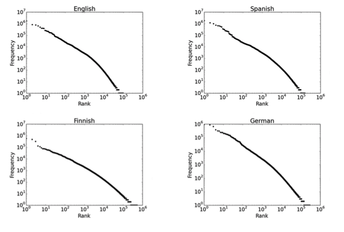

# 1-2 20170825 Week1 Course2 Notes

## 1 Commands Explanation
### 1.0 Preparation

1. Install Anaconda
2. Create py 3.6 environment: [How to?](https://conda.io/docs/user-guide/getting-started.html)
3. source activate [your py3.6 env_name]
4. pip install BeautifulSoup4
5. pip install lxml


### 1.1 Word Count

```bash
# Replace all white space into \n
# For example, to replace all occurrences of ‘hello’ to ‘world’ in the file input.txt:
# sed 's/hello/world/' input.txt > output.txt
# s means substitute
# g means global: Perform a global match (find all matches rather than stopping after the first match)
# | pipe. Passes the output (stdout) of a previous command to the input (stdin) of the next one, or to the shell. This is a method of chaining commands together.
gsed 's/ /\n/g' sawyr11.txt | less


# -v Display all lines that do NOT match.
# ^ Matches the starting position within the string. In line-based tools, it matches the starting position of any line.
# $ Matches the ending position of the string or the position just before a string-ending newline. In line-based tools, it matches the ending position of any line.


# so the [grep -v "^$"] command excludes all empty lines
gsed 's/ /\n/g' sawyr11.txt | grep -v "^$" | less


# sort sorts the contents of a text file, line by line.
gsed 's/ /\n/g' sawyr11.txt | grep -v "^$" | sort | less


# uniq reports or filters out repeated lines in a file.
# -c, --count Prefix lines with a number representing how many times they occurred.
gsed 's/ /\n/g' sawyr11.txt | grep -v "^$" | sort | uniq -c | less


# -k, --key=POS1[,POS2]	Start a key at POS1 (origin 1), end it at POS2 (default end of line). See POS syntax below.
# -r, --reverse	Reverse the result of comparisons.
# -n ‘--numeric-sort’ ‘--sort=numeric’ Sort numerically. The number begins each line and consists of optional blanks, an optional ‘-’ sign, and zero or more digits possibly separated by thousands separators, optionally followed by a decimal-point character and zero or more digits. An empty number is treated as ‘0’.
gsed 's/ /\n/g' sawyr11.txt | grep -v "^$" | sort | uniq -c | sort -k1nr | less

# -3 means display the first 3 lines
gsed 's/ /\n/g' sawyr11.txt | grep -v "^$" | sort | uniq -c | sort -k1nr | head -3

# -n, --lines=K	Output the last K lines, instead of the default of the last 10; alternatively, use "-n +K" to output lines starting with the Kth.
gsed 's/ /\n/g' sawyr11.txt | grep -v "^$" | sort | uniq -c | sort -k1nr | tail -n +2

# > output result to the md.wordcount.txt
gsed 's/ /\n/g' sawyr11.txt | grep -v "^$" > md.word.txt

# paste Once invoked, paste will read all its file arguments. For each corresponding line, paste will append the contents of each file at that line to its output along with a tab.
paste md.word.txt md.word.txt | less

# output the words from 2nd to the end
tail -n+2 md.word.txt | less

# every 2 consecutive words makes up a line
cp md.word.txt md.word2.txt
paste md.word.txt <(tail -n +2 md.word.txt)

# count the frequency of every 2 consecutive words
paste md.word.txt <(tail -n +2 md.word.txt) | sort | uniq -c | sort -k1nr | head -5

# wc output the number of lines, the number of words, and the number of characters.
# the result of the following commands:  70090  70090 385339 md.word.txt
# so there are 70090 words, including duplicate words
wc md.word.txt

# count the number of the unique words
# the result is "13179   26358  212839", so there are 13179 unique words
gsed 's/ /\n/g' sawyr11.txt | grep -v "^$" | sort | uniq -c | wc

# awk - Finds and Replaces text, database sort/validate/index
# AWK is an interpreted programming language which focuses on processing text.
# $1 means the first position, and $1==1 means the word occurs only once
# {print} means print out the whole line
# wc counts the words that occurs only once
# result: 8388   16776  140270
gsed 's/ /\n/g' sawyr11.txt | grep -v "^$" | sort | uniq -c | awk '$1==1{print}' | wc

# if we take 2 consecutive words as a group,
# we can count the number of the 2-word groups that occur only once
# result:   40240  120719  819181
paste md.word.txt <(tail -n+2 md.word.txt) | sort | uniq -c | sort -k1nr | awk '$1==1{print}' | wc


```

### 1.2 Sentiment Analysis

```bash
# count postive.rawtext and negative.rawtext
# result:
# 2116 negative.rawtext
# 2198 positive.rawtext
# 4314 total
wc -l *.rawtext


# press shift + tab, choose the file headed by "posi"
paste posi


# The yes command outputs the same string, STRING, in a constant stream. If STRING is not specified, the word it repeats is "y".
yes "pos" | head

# extract data from xml-ish format. note the command "expand" which I use to remove tabs
for i in positive negative; do ./extract.py -i $i.review | expand -t 1 > $i.rev.txt; done

# paste 2198 "pos" tag to positive.rawtext > pos.tagged
# paste 2116 "neg" tag to negative.rawtext > neg.tagged
paste positive.rawtext <(yes "pos" | head -2198) | less
paste negative.rawtext <(yes "neg" | head -2116) | less

paste positive.rawtext <(yes "pos" | head -2198) > pos.tagged
paste negative.rawtext <(yes "neg" | head -2116) > neg.tagged

# gshuf - "shuffle", generate random permutations
mkdir data
cat pos.tagged neg.tagged | gshuf > data/all

cat <(yes "pos" | head -200) <(yes "neg" | head -200) | gshuf > random.pred

# divide into dev, test, train sets
cd data
head -800 all > devtest
tail -n+801 all > train
head -400 devtest > dev
tail -400 devtest > test

# separate text from labels in train, dev, and test sets
# cut Remove or "cut out" sections of each line of a file or files.
# -f, --fields=LIST	select only these fields on each line; also print any line that contains no delimiter character, unless the -s option is specified. LIST specifies a field, a set of fields, or a range of fields;
for i in train dev test; do cut -f1 $i > $i.txt; cut -f2 $i > $i.label; done

# list the files in folder data
# results will be
# all  dev.label	devtest      test	 test.txt  train.label
# dev  dev.txt	random.pred  test.label  train	   train.txt
ls

# random baseline on dev and simple scorer
# prepare 50/50 randomly arranged 'predictions' for dev set
for i in pos neg; do yes "$i" | head -200; done | gshuf > dev.random.pred

# score random predictions
paste dev.random.pred dev.label | awk '$1==$2{a+=1.0}END{print a/NR}'


head -5 data/train.txt | cut -f1 | awk '{print NR, $0, "\n"}'

# learn how to run basic classifier (I forgot how to run it)
./simplesent.py -h
# run basic classifier
./simplesent.py -i data/dev.txt -p positive.txt -n negative.txt -o dev.ss.pred
# score basic classifier predictions
paste dev.ss.pred data/dev.label | awk '$1==$2{a+=1.0}END{print a/NR}'
```


## 2 Terms

### 2.1 Sparsity and Zipf's Law



<div style="text-align:center;">
  <span style="font-size:16px;">Word Frequencies</span>
</div>

Summarizes the behaviour we just saw:

<div style="text-align:center;">
  <span style="font-size:30px;">f * r = k</span>
</div>

* f = frequency of a word
* r = rank of a word (if sorted by frequency)
* k = a constant

Why a line in log-scales? fr=k => f=k => logf=logk - logr

**Implications of Zipf’s Law**

- Regardless of how large our corpus is, there will be a lot of infrequent (and zero-frequency!) words.
- In fact, the same holds for many other levels of linguistic structure (e.g., syntactic rules in a CFG).
- This means we need to find clever ways to estimate probabilities for things we have rarely or never seen.


### 2.2 Sentiment Analysis

**Annotations**

To evaluate and compare sentiment analyzers, we need reviews with gold labels (+ or -) attached. These can be

- derived automatically from the original data artifact (metadata such as star ratings), or

- added by a human annotator who reads the text

  - Issue to consider/measure: How consistent are human annotators? If theyoften have trouble deciding or agreeing, how can this be addressed?

**An evaluation measure**
