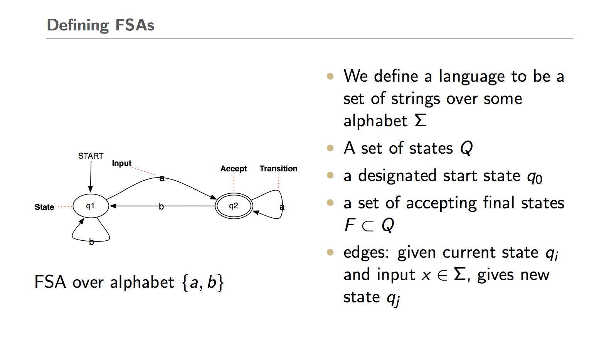
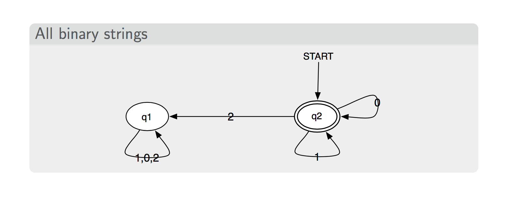
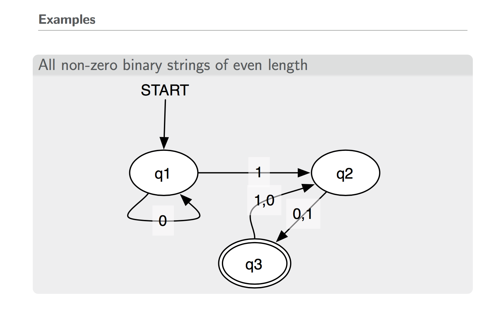

# 2-1 20170830 Week2 Course1 Notes

## 1. Regular Expression

Regular Expression is simple. So here I will just list some notes that we are easy to be confused with.

- Negations [^Ss]
  - Carat means negation only when first in []
  - [^e^] matches "Look h**e**re"
  - a^b matches "Look up **a^b** now"

- The pipe | for disjunction
  - a|b|c = [abc]

## 2. Errors

Errors:

The process we just went through was based on fixing two kinds of errors
- Matching strings that we should not have matched (there, then, other)
  - False positives (Type I)
- Not matching things that we should have matched (The)
  - False negatives (Type II)

Reducing the error rate for an application often involves two antagonistic efforts:
- Increasing accuracy or precision (minimizing false positives)
- Increasing coverage or recall (minimizing false negatives).

## 3. Word Tokenization

Example: Seuss’s cat in the hat is different from other cats!
- **Lemma**: same stem, part of speech, rough word sense
  - cat and cats = same lemma
- **Wordform**: the full inflected surface form
  - cat and cats = different wordforms

Example: they lay back on the San Francisco grass and looked at the stars and their
- Type: an element of the vocabulary.
- Token: an instance of that type in running text.

## 4. Typical Pipeline for nlp Tasks
- **Find the “units of meaning”**
- Do “shallow” analysis (pos tagging)
- Do sentence-level analysis (parsing, srl)
- Do document-level analysis (topic models, classification)
- Extrinsic task (question answering)

### 4.1 Find the “units of meaning"

Terms:
- **Morpheme**: Smallest unit of language that carries meaning.
  - “books”: two morphemes (“book” and “s”), one syllable
  - “unladylike”: three morphemes, four syllables
- **Derivational**: You have a new word derived from an existing word that alters the meaning.
  - Nominalization: computerization, appointee, killer
  - Adjectivization: computational, clueless, embraceable
- **Inflectional**: You have a variation of a word that expresses grammatical contrast
- **Root**: common to a set of derived or inflected forms
- **Stem**: root or roots of a word together with derivational affixes
- **Affix**: bound morpheme that comes after or within a root or stem
- **Clitic**: a morpheme that functions like a word but doesn’t appear on its own (e.g., the ’ve in “I’ve”)

## 5. Finite-State Automata

Understand the Finite-State Automata:

- **q0,q1,q2**, means different states.

- The **text** on the arrows means input.

- The **arrow** means state swicthing.

- The **double circle** means the state that we will accept.

Examples:

## 6. Connec
